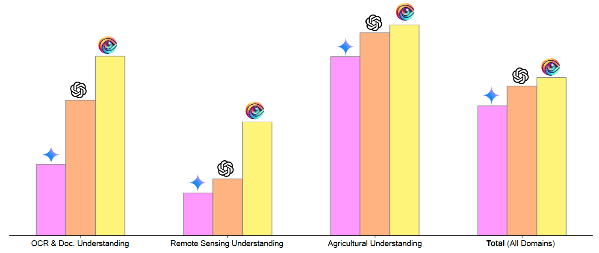

<div style="display: flex; align-items: center;">
  
  <h1 style="margin: 0; font-size: 28px;";">AIN: The Arabic INclusive Large Multimodal Model</h1>
</div>

[Ahmed Heakl](https://huggingface.co/ahmedheakl) <sup> * </sup> &nbsp;
[Sara Ghaboura](https://huggingface.co/SLMLAH) <sup> * </sup> &nbsp;
[Omkar Thawakar](https://omkarthawakar.github.io) &nbsp;
[Fahad Shahbaz Khan](https://scholar.google.com/citations?hl=en&user=zvaeYnUAAAAJ) &nbsp;
[Hisham Cholakkal](https://scholar.google.com/citations?hl=en&user=bZ3YBRcAAAAJ) &nbsp;
[Rao M. Anwer](https://scholar.google.com/citations?hl=en&user=_KlvMVoAAAAJ) &nbsp;
[Salman Khan](https://scholar.google.com/citations?hl=en&user=M59O9lkAAAAJ)
<br>
<em> <sup> *Equal Contribution  </sup> </em>
<br>
#### **Mohamed Bin Zayed University of Artificial Intelligence (MBZUAI), UAE**
[](https://arxiv.org/abs/2502.00094)
[](https://mbzuai-oryx.github.io/AIN/)
[](https://github.com/mbzuai-oryx/AIN)
[](https://github.com/mbzuai-oryx/AIN/issues)
[](https://github.com/mbzuai-oryx/AIN/stargazers)
[](https://github.com/mbzuai-oryx/AIN/blob/main/LICENSE)

---


<div class="abstract-container">
  <h2>Abstract</h2>
     <div class="abstract-content">
        <p>
           Amid the swift progress of large language models (LLMs) and their evolution into large multimodal models (LMMs), significant strides have been made in high-resource languages such as English and Chinese. While Arabic LLMs have seen notable progress, Arabic LMMs remain largely unexplored, often narrowly focusing on a few specific aspects of the language and visual understanding. To bridge this gap, we introduce <b><em>AIN - the Arabic Inclusive Multimodal Model-</em></b> designed to excel across diverse domains.
           AIN is an English-Arabic <b>bilingual LMM</b> designed to excel in English and Arabic, leveraging carefully constructed <b>3.6 million</b> high-quality Arabic-English multimodal data samples. AIN demonstrates state-of-the-art Arabic performance, while also possessing strong English-language visual capabilities.
        </p>
    </div>
 </div>


  
 ## 🌟 Key Features
 - The **first Arabic-centric inclusive Large Multimodal Model (LMM)** trained on **3.6M samples**.
 - Includes **35% authentic Arabic data** within its Arabic data subset.
 - Achieves **superior performance compared to open- and closed-source models** (e.g., GPT-4o) and open-source models (e.g., Qwen2-VL-7B) across tasks such as OCR and specialized domains.
 - Demonstrates **robust bilingual capabilities** (Arabic/English), **validated** through **comprehensive testing** and **human evaluation** across 17 Arab countries.
 - Exhibits **advanced cultural understanding** and domain expertise in fields such as **medical imaging**, **agriculture**, and **scientific visualization**.


<p align="center">
   
   <h6>
       <em>  <b>Figure 1.</b> Comparative performance of AIN-7B against other models across key domains, including OCR & Document Understanding, Remote Sensing, Agricultural Understanding, and overall performance across all domains. </em>
   </h6>
</p> 

<p align="center" >
   
 <h6>
       <em>  <b>Figure 2.</b> showcases a comprehensive performance analysis of AIN-7B across CAMEL-Bench domains, comparing it with prominent closed-source models as well as open-source counterparts. <strong>OCR:</strong> "OCR & Document Understanding",  <strong>Video:</strong> "General Video & Multi-Image Understanding",  <strong>RS:</strong> "Remote Sensing Understanding", <strong>CDT:</strong> "Chart, Diagram & Table Understanding",  <strong>Agro.:</strong> "Agricultural Image Understanding", <strong>Cultural:</strong> "Cultural-Specific Understanding", <strong>Medical:</strong> "Medical Image Understanding".
       </em> 
 </h6>

---
## ⚖️ Quick Start
Please install the qwen vision kit. This includes base64, URLs, and interleaved images and videos. You can install it using the following command:

```bash
pip install qwen-vl-utils
```

Here we show a code snippet to show you how to use the chat model with `transformers` and `qwen_vl_utils`:

```python
from transformers import Qwen2VLForConditionalGeneration, AutoTokenizer, AutoProcessor
from qwen_vl_utils import process_vision_info
# default: Load the model on the available device(s)
model = Qwen2VLForConditionalGeneration.from_pretrained(
    "MBZUAI/AIN", torch_dtype="auto", device_map="auto"
)
# We recommend enabling flash_attention_2 for better acceleration and memory saving, especially in multi-image and video scenarios.
# model = Qwen2VLForConditionalGeneration.from_pretrained(
#     "MBZUAI/AIN",
#     torch_dtype=torch.bfloat16,
#     attn_implementation="flash_attention_2",
#     device_map="auto",
# )
# default processer
processor = AutoProcessor.from_pretrained("MBZUAI/AIN")
# The default range for the number of visual tokens per image in the model is 4-16384. You can set min_pixels and max_pixels according to your needs, such as a token count range of 256-1280, to balance speed and memory usage.
# min_pixels = 256*28*28
# max_pixels = 1280*28*28
# processor = AutoProcessor.from_pretrained("MBZUAI/AIN", min_pixels=min_pixels, max_pixels=max_pixels)
messages = [
    {
        "role": "user",
        "content": [
            {
                "type": "image",
                "image": "https://huggingface.co/MBZUAI/AIN/resolve/main/assets_hf/demo_image.jpeg",
            },
            {"type": "text", "text": "يرجى وصف هذه الصورة."},
        ],
    }
]
# Preparation for inference
text = processor.apply_chat_template(
    messages, tokenize=False, add_generation_prompt=True
)
image_inputs, video_inputs = process_vision_info(messages)
inputs = processor(
    text=[text],
    images=image_inputs,
    videos=video_inputs,
    padding=True,
    return_tensors="pt",
)
inputs = inputs.to("cuda")
# Inference: Generation of the output
generated_ids = model.generate(**inputs, max_new_tokens=128)
generated_ids_trimmed = [
    out_ids[len(in_ids) :] for in_ids, out_ids in zip(inputs.input_ids, generated_ids)
]
output_text = processor.batch_decode(
    generated_ids_trimmed, skip_special_tokens=True, clean_up_tokenization_spaces=False
)
print(output_text)
```
<details>
<summary>Without qwen_vl_utils</summary>

```python
from PIL import Image
import requests
import torch
from torchvision import io
from typing import Dict
from transformers import Qwen2VLForConditionalGeneration, AutoTokenizer, AutoProcessor
# Load the model in half-precision on the available device(s)
model = Qwen2VLForConditionalGeneration.from_pretrained(
    "MBZUAI/AIN", torch_dtype="auto", device_map="auto"
)
processor = AutoProcessor.from_pretrained("MBZUAI/AIN")
# Image
url = "https://huggingface.co/MBZUAI/AIN/resolve/main/assets_hf/demo_image.jpeg"
image = Image.open(requests.get(url, stream=True).raw)
conversation = [
    {
        "role": "user",
        "content": [
            {
                "type": "image",
            },
            {"type": "text", "text": "Describe this image in Arabic."},
        ],
    }
]
# Preprocess the inputs
text_prompt = processor.apply_chat_template(conversation, add_generation_prompt=True)
# Excepted output: '<|im_start|>system\nYou are a helpful assistant.<|im_end|>\n<|im_start|>user\n<|vision_start|><|image_pad|><|vision_end|>Describe this image.<|im_end|>\n<|im_start|>assistant\n'
inputs = processor(
    text=[text_prompt], images=[image], padding=True, return_tensors="pt"
)
inputs = inputs.to("cuda")
# Inference: Generation of the output
output_ids = model.generate(**inputs, max_new_tokens=128)
generated_ids = [
    output_ids[len(input_ids) :]
    for input_ids, output_ids in zip(inputs.input_ids, output_ids)
]
output_text = processor.batch_decode(
    generated_ids, skip_special_tokens=True, clean_up_tokenization_spaces=True
)
print(output_text)
```
</details>
<details>
<summary>Multi image inference</summary>

```python
# Messages containing multiple images and a text query
messages = [
    {
        "role": "user",
        "content": [
            {"type": "image", "image": "file:///path/to/image1.jpg"},
            {"type": "image", "image": "file:///path/to/image2.jpg"},
            {"type": "text", "text": "Identify the similarities between these images."},
        ],
    }
]
# Preparation for inference
text = processor.apply_chat_template(
    messages, tokenize=False, add_generation_prompt=True
)
image_inputs, video_inputs = process_vision_info(messages)
inputs = processor(
    text=[text],
    images=image_inputs,
    videos=video_inputs,
    padding=True,
    return_tensors="pt",
)
inputs = inputs.to("cuda")
# Inference
generated_ids = model.generate(**inputs, max_new_tokens=128)
generated_ids_trimmed = [
    out_ids[len(in_ids) :] for in_ids, out_ids in zip(inputs.input_ids, generated_ids)
]
output_text = processor.batch_decode(
    generated_ids_trimmed, skip_special_tokens=True, clean_up_tokenization_spaces=False
)
print(output_text)
```
</details>

<details>
<summary>Video inference</summary>

```python
# Messages containing a images list as a video and a text query
messages = [
    {
        "role": "user",
        "content": [
            {
                "type": "video",
                "video": [
                    "file:///path/to/frame1.jpg",
                    "file:///path/to/frame2.jpg",
                    "file:///path/to/frame3.jpg",
                    "file:///path/to/frame4.jpg",
                ],
                "fps": 1.0,
            },
            {"type": "text", "text": "Describe this video."},
        ],
    }
]
# Messages containing a video and a text query
messages = [
    {
        "role": "user",
        "content": [
            {
                "type": "video",
                "video": "file:///path/to/video1.mp4",
                "max_pixels": 360 * 420,
                "fps": 1.0,
            },
            {"type": "text", "text": "Describe this video."},
        ],
    }
]
# Preparation for inference
text = processor.apply_chat_template(
    messages, tokenize=False, add_generation_prompt=True
)
image_inputs, video_inputs = process_vision_info(messages)
inputs = processor(
    text=[text],
    images=image_inputs,
    videos=video_inputs,
    padding=True,
    return_tensors="pt",
)
inputs = inputs.to("cuda")
# Inference
generated_ids = model.generate(**inputs, max_new_tokens=128)
generated_ids_trimmed = [
    out_ids[len(in_ids) :] for in_ids, out_ids in zip(inputs.input_ids, generated_ids)
]
output_text = processor.batch_decode(
    generated_ids_trimmed, skip_special_tokens=True, clean_up_tokenization_spaces=False
)
print(output_text)
```
</details>

<details>
<summary>Batch inference</summary>

```python
# Sample messages for batch inference
messages1 = [
    {
        "role": "user",
        "content": [
            {"type": "image", "image": "file:///path/to/image1.jpg"},
            {"type": "image", "image": "file:///path/to/image2.jpg"},
            {"type": "text", "text": "What are the common elements in these pictures?"},
        ],
    }
]
messages2 = [
    {"role": "system", "content": "You are a helpful assistant."},
    {"role": "user", "content": "Who are you?"},
]
# Combine messages for batch processing
messages = [messages1, messages1]
# Preparation for batch inference
texts = [
    processor.apply_chat_template(msg, tokenize=False, add_generation_prompt=True)
    for msg in messages
]
image_inputs, video_inputs = process_vision_info(messages)
inputs = processor(
    text=texts,
    images=image_inputs,
    videos=video_inputs,
    padding=True,
    return_tensors="pt",
)
inputs = inputs.to("cuda")
# Batch Inference
generated_ids = model.generate(**inputs, max_new_tokens=128)
generated_ids_trimmed = [
    out_ids[len(in_ids) :] for in_ids, out_ids in zip(inputs.input_ids, generated_ids)
]
output_texts = processor.batch_decode(
    generated_ids_trimmed, skip_special_tokens=True, clean_up_tokenization_spaces=False
)
print(output_texts)
```
</details>

### More Usage Tips

For input images, we support local files, base64, and URLs. For videos, we currently only support local files.

```python
# You can directly insert a local file path, a URL, or a base64-encoded image into the position where you want in the text.
## Local file path
messages = [
    {
        "role": "user",
        "content": [
            {"type": "image", "image": "file:///path/to/your/image.jpg"},
            {"type": "text", "text": "Describe this image."},
        ],
    }
]
## Image URL
messages = [
    {
        "role": "user",
        "content": [
            {"type": "image", "image": "http://path/to/your/image.jpg"},
            {"type": "text", "text": "Describe this image."},
        ],
    }
]
## Base64 encoded image
messages = [
    {
        "role": "user",
        "content": [
            {"type": "image", "image": "data:image;base64,/9j/..."},
            {"type": "text", "text": "Describe this image."},
        ],
    }
]
```
#### Image Resolution for performance boost

The model supports a wide range of resolution inputs. By default, it uses the native resolution for input, but higher resolutions can enhance performance at the cost of more computation. Users can set the minimum and maximum number of pixels to achieve an optimal configuration for their needs, such as a token count range of 256-1280, to balance speed and memory usage.

```python
min_pixels = 256 * 28 * 28
max_pixels = 1280 * 28 * 28
processor = AutoProcessor.from_pretrained(
    "MBZUAI/AIN", min_pixels=min_pixels, max_pixels=max_pixels
)
```

Besides, We provide two methods for fine-grained control over the image size input to the model:

1. Define min_pixels and max_pixels: Images will be resized to maintain their aspect ratio within the range of min_pixels and max_pixels.
   
2. Specify exact dimensions: Directly set `resized_height` and `resized_width`. These values will be rounded to the nearest multiple of 28.

```python
# min_pixels and max_pixels
messages = [
    {
        "role": "user",
        "content": [
            {
                "type": "image",
                "image": "file:///path/to/your/image.jpg",
                "resized_height": 280,
                "resized_width": 420,
            },
            {"type": "text", "text": "Describe this image."},
        ],
    }
]
# resized_height and resized_width
messages = [
    {
        "role": "user",
        "content": [
            {
                "type": "image",
                "image": "file:///path/to/your/image.jpg",
                "min_pixels": 50176,
                "max_pixels": 50176,
            },
            {"type": "text", "text": "Describe this image."},
        ],
    }
]
```
  
---
## ⚖️ Quantitative Evaluation and Results
AIN demonstrates state-of-the-art performance across diverse domains, surpassing both open- and closed-source models. Notably, it achieves an aggregate performance score of 63.77%, with significant gains in OCR, remote sensing, and agricultural image understanding.

<div align="center" >
<table>
    <caption>
        <h6>
        <strong>Table 1. Performance comparison of AIN and different closed- and open-source LMMs across CAMEL-Bench domains.</strong> 
        <br> <em>Best performance is marked with 🥇; second-best is 🥈.</em>
            <strong>OCR</strong>: "OCR & Document Understanding", 
            <strong>Video</strong>: "General Video & Multi-Image Understanding", 
            <strong>RS</strong>: "Remote Sensing Understanding", 
            <strong>CDT</strong>: "Chart, Diagram & Table Understanding", 
            <strong>Agro.</strong>: "Agricultural Image Understanding", 
            <strong>Cult.</strong>: "Cultural-Specific Understanding",  
            <strong>Med.</strong>: "Medical Image Understanding".
        </h6>
    </caption>
    <thead>
        <tr style="background-color: #e0e0e0;">
            <th>Models</th>
            <th>VQA</th>
            <th>OCR</th>
            <th>Video</th>
            <th>RS</th>
            <th>CDT</th>
            <th>Agro.</th>
            <th>Cult.</th>
            <th>Med.</th>
            <th style="background-color: #d0d0d0;">Total</th>
        </tr>
    </thead>
    <tbody>
        <tr>
            <td>GPT-4o</td>
            <td>🥈55.15</td>
            <td>🥈54.98</td>
            <td>🥇69.65</td>
            <td>🥈27.36</td>
            <td>🥈62.35</td>
            <td>🥈80.75</td>
            <td>🥇80.86</td>
            <td>🥇49.91</td>
            <td style="background-color: #d0d0d0;">🥈60.13</td>
        </tr>
        <tr>
            <td>GPT-4o-mini</td>
            <td>48.83</td>
            <td>39.38</td>
           <td>🥈66.28</td>
            <td>16.93</td>
            <td>56.37</td>
            <td>78.80</td>
            <td>65.92</td>
           <td>🥈47.37</td>
            <td style="background-color: #d0d0d0;">52.49</td>
        </tr>
        <tr>
            <td>Gemini-1.5-Pro</td>
            <td>46.68</td>
            <td>28.68</td>
            <td>42.95</td>
            <td>17.07</td>
            <td>47.06</td>
            <td>72.14</td>
            <td>56.24</td>
            <td>33.78</td>
            <td style="background-color: #d0d0d0;">52.38</td>
        </tr>
        <tr>
            <td>Gemini-1.5-flash</td>
            <td>45.59</td>
            <td>27.58</td>
            <td>53.31</td>
            <td>14.95</td>
            <td>48.26</td>
            <td>76.07</td>
            <td>46.54</td>
            <td>42.87</td>
            <td style="background-color: #d0d0d0;">44.40</td>
        </tr>
        <tr>
            <td>InternVL-8B </td>
            <td>30.41 </td>
            <td>15.91 </td>
            <td>51.42 </td>
            <td>5.36 </td>
            <td>30.27 </td>
            <td>44.47 </td>
            <td>20.88 </td>
            <td>29.48 </td>
            <td style="background-color: #d0d0d0;">28.52 </td>
        </tr>
        <tr>
            <td>InternVL2.5-1B </td>
            <td>27.22 </td>
            <td>19.45 </td>
            <td>38.20 </td>
            <td>3.39 </td>
            <td>30.75 </td>
            <td>39.53 </td>
            <td>35.68 </td>
            <td>21.27 </td>
            <td style="background-color: #d0d0d0;">26.94 </td>
        </tr>
        <tr>
            <td>Qwen-VL-2B </td>
            <td>41.02 </td>
            <td>22.93 </td>
            <td>38.90 </td>
            <td>12.56 </td>
            <td>27.83 </td>
            <td>52.02 </td>
            <td>34.28 </td>
            <td>29.12 </td>
            <td style="background-color: #d0d0d0;">32.33 </td>
        </tr>
        <tr>
            <td>Qwen2-VL-7B </td>
            <td>48.76 </td>
            <td>42.73 </td>
            <td>61.97 </td>
            <td>21.30 </td>
            <td>54.67 </td>
            <td>79.32 </td>
            <td>75.96 </td>
            <td>35.81 </td>
            <td style="background-color: #d0d0d0;">52.57 </td>
        </tr>
        <tr>
            <td>AIN-7B <em>(ours)</em> </td>
           <td>🥇56.78 </td>
            <td>🥇72.35 </td>
            <td>64.09 </td>
            <td>🥇45.92 </td>
           <td>🥇64.10 </td>
            <td>🥇85.05 </td>
           <td>🥈78.09 </td>
            <td>43.77 </td>
            <td style="background-color: #d0d0d0;">🏆63.77 </td>
        </tr>
    </tbody>
</table>
   </div>         
   
---
## 🎯 Qualitative Evaluation
The qualitative evaluation showcases AIN's advanced capabilities in handling diverse, complex tasks, including OCR, medical imaging, remote sensing, and cultural-specific understanding, with remarkable precision and contextual relevance. Unlike GPT-4o and LLaVA, AIN demonstrates superior performance in identifying intricate details and maintaining accuracy across varied query formats and multi-domain challenges.

<div align="center">
  
     <h6>
       <em>  <b>Figure 3.</b> Qualitative examples showcasing AIN-7B’s capabilities across various domains, including general VQA, OCR & Document Understanding, Remote Sensing, Medical Imaging, Agricultural Understanding, and Cultural-Specific tasks. </em>
    </h6>
</div>

---
## 🧐 Data Verification and Toxicity Filtering
A multi-step verification pipeline was implemented to ensure high-quality translations and safe visual data. Translation accuracy was assessed through human evaluation, where native Arabic speakers rated outputs against reference translations, and semantic similarity checks were conducted using **LaBSE**. Additionally, translated samples were reverse-translated and validated using **BLEU, METEOR, and ROUGE scores** to measure correctness, correlation, and overlap. For visual data, toxicity filtering was applied using **LLavaGuard’s safety policies and GPT-4o**, identifying and removing unsafe content related to violence, substance abuse, and harmful imagery, ensuring compliance with ethical AI standards.

<p align="center">
   
    <h6>
       <em>  <b>Figure 4.</b> Data verification and filtering pipeline for textual and visual data, ensuring high-quality training data through semantic similarity checks, translation quality evaluations, and toxicity screening for safety compliance. </em>
    </h6>
</p> 
<p align="center">
   
    <h6>
       <em>  <b>Figure 5.</b> Distribution of visual data toxicity filtering results, showing that 95% of the data is classified as safe, while 5% is identified as unsafe due to categories like weapons or substance abuse, violence, and animal cruelty. </em>
   </h6>
</p> 

---

## 🔒 License
This project is licensed under the MIT License - see the [LICENSE](LICENSE) file for details.


## 💬 Contact us
For questions or suggestions, feel free to reach out to us on [GitHub Discussions](https://github.com/mbzuai-oryx/AIN/discussions).

---

If you use AIN in your research, please cite our work as follows: 

```
@misc{heakl2025ainarabicinclusivelarge,
      title={AIN: The Arabic INclusive Large Multimodal Model}, 
      author={Ahmed Heakl and Sara Ghaboura and Omkar Thawkar and Fahad Shahbaz Khan and Hisham Cholakkal and Rao Muhammad Anwer and Salman Khan},
      year={2025},
      eprint={2502.00094},
      url={https://arxiv.org/abs/2502.00094}, 
```
---